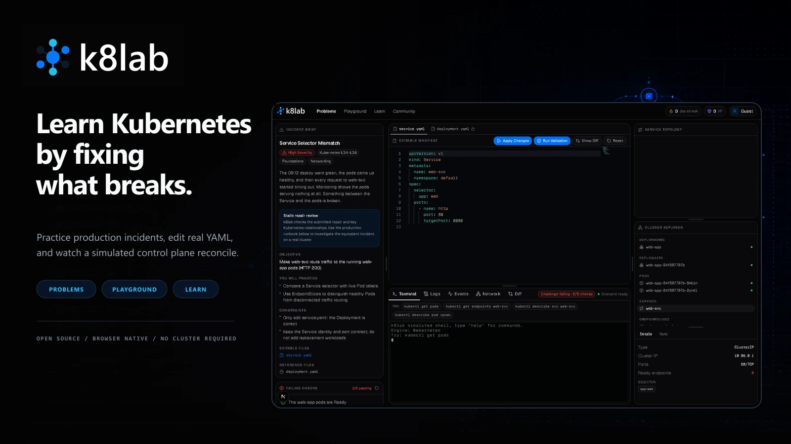

# k8lab



> Learn Kubernetes by debugging real (simulated) clusters — not slides.

**k8lab** is a gamified, hands-on Kubernetes learning platform that runs entirely in your
browser. Debug broken clusters in incident labs, experiment freely in a sandbox, and study
interactive docs where concepts reconcile live. No install, no cloud bill, no risk.

It's built to feel like a Vercel-quality developer tool: dark, minimal, fast, accessible,
and meticulously polished.

Three areas, all backed by the same in-browser Kubernetes simulation:

- **/problems** — gamified incident labs. Read the signals, form a theory, edit real YAML,
  and prove your fix against hidden, behavior-based validators.
- **/playground** — a free sandbox: pick a template, edit manifests across files, apply,
  and watch the control plane reconcile in a live topology.
- **/docs** — interactive lessons whose inline labs boot a cluster you can poke.

> **Status:** feature-complete MVP. All three areas work end-to-end in a real browser,
> covered by unit/integration tests and Playwright E2E.

---

## Quick start

Requires **Node 24** and **pnpm 11.10.0** (via
[corepack](https://nodejs.org/api/corepack.html)).

```bash
corepack enable        # activates the pnpm version pinned in package.json
pnpm install
pnpm doctor            # verifies the local toolchain and configuration
pnpm dev               # http://localhost:3000
```

### Scripts

| Script | What it does |
|--------|--------------|
| `pnpm dev` | Dev server (Turbopack) |
| `pnpm build` / `pnpm start` | Production build / serve |
| `pnpm lint` | ESLint (flat config) |
| `pnpm typecheck` | `tsc --noEmit`, strict mode |
| `pnpm test` / `pnpm test:watch` | Unit + integration tests (Vitest) |
| `pnpm test:api` / `pnpm test:all` | Postgres-backed API tests / all Vitest suites |
| `pnpm check:fast` / `pnpm verify` | Local pre-push checks / complete CI quality gate |
| `pnpm security:audit` | Block high or critical production dependency advisories |
| `pnpm test:e2e` | End-to-end tests (Playwright; run `pnpm exec playwright install chromium` once) |
| `pnpm format` / `pnpm format:check` | Prettier write / check |
| `pnpm doctor` | Validate Node, pnpm, dependencies, Git, and local backend configuration |
| `pnpm smoke:production [url]` | Verify deployment health and protected-route behavior |

## Tech stack

Next.js 16 (App Router) · React 19 · TypeScript (strict) · Tailwind CSS v4 · Radix
primitives · Geist fonts · Lucide icons · Monaco editor · xterm.js · React Flow
(`@xyflow/react`) · Zod · **Webernetes** (`@ngrok/webernetes`, in-browser Kubernetes) ·
Zustand · Vitest + Testing Library + Playwright.

## Architecture

Route files stay thin — they compose components and pass params. Product logic lives in
`features/` and `lib/`.

Public product identity is configured in one place: `src/config/brand.tsx`. It owns the
display name, team/account labels, metadata copy, public URLs, logo colors, and the shared SVG
mark used to generate the browser favicon. Stable cookies, storage keys, and simulated image
names are deliberately outside the Brand so a visual rename cannot invalidate user data.

```
src/
  app/                 # App Router routes: /, problems, playground, docs, progress
  components/
    app-shell/         # AppShell, TopNav, ⌘K action wiring, ErrorBoundary
    command-palette/   # ⌘K palette (Radix Dialog)
    editor/            # Monaco YAML editor + diff (dynamic, ssr:false)
    terminal/          # xterm.js terminal (dynamic)
    topology/          # React Flow service topology (dynamic)
    object-explorer/   # cluster tree + object details
    events/ icons/ ui/ # events timeline; icon map; copy-owned primitives
  features/
    problems/          # level workspace, useSimulator hook, level store
    playground/        # sandbox workspace + store
    docs/              # lesson renderer + interactive lab
    progress/          # progress dashboard + useProgress
  lib/
    design/tokens.ts   # single source of truth for colors/radii/shadows
    domain/            # types.ts + Zod schemas for all content
    kube/              # KubeSimulator, command-runner, validators, evidence, images/
    storage/           # guest progress, account sync, and docs→playground handoff
  content/             # levels/, docs/, playground-templates/ (Zod-validated at load)
  config/brand.tsx     # public name, copy, URLs, logo, and favicon source
  tests/               # unit, component, integration (Vitest); e2e (Playwright)
```

### The design system

Colors, radii, and shadows are defined once in `src/lib/design/tokens.ts` and mirrored into
CSS variables via Tailwind v4's `@theme` in `src/app/globals.css`. Components use semantic
utilities (`bg-panel`, `text-muted`, `border-border`) — **no hardcoded hex** outside the
token files. Status is never conveyed by color alone; it always pairs with an icon + text.

### Simulation is not real Kubernetes

k8lab simulates a Kubernetes control plane in the browser via Webernetes (real scheduler,
controllers, and a kubelet with HTTP readiness/liveness probers). Container "images" are
lightweight **TypeScript fakes** that emulate app behavior (health endpoints, DNS calls) —
they are **not** OCI images and nothing is pulled or executed. Where the simulation
intentionally diverges from real Kubernetes, the code says so in a comment.

**Simulator note:** Webernetes' ReplicaSet controller drives toward `readyReplicas`, so a
Deployment whose pods never become Ready keeps creating pods. For any *broken / not-Ready*
scenario, model the workload as a **bare Pod** (the reference level and all docs labs do).

## Extending k8lab

All static content is validated by Zod at load time, so an invalid entry fails the build.

### Add a problem level

1. Create `src/content/levels/<slug>.ts` exporting a `ProblemLevel` (use `satisfies
   ProblemLevel`): story, objective, constraints, editable `files`, `initialManifests`,
   `registeredImages`, behavior-based `validators`, progressive `hints`, `evidenceRules`,
   and a `postSolveExplanation`.
2. Register it in `src/content/levels/index.ts` — add it to `LEVELS` (playable) and add a
   summary to `LEVEL_CATALOG`.

### Add a simulated image

1. Create `src/lib/kube/images/<name>.ts` — a class `extends BaseImage` with static
   `imageName`/`imageVersion`, a `defaultCommand`, and an `async exec(ctx, argv)` that
   serves HTTP via `ctx.listenHttp(port, handler)` and stays alive with
   `await ctx.waitUntilKilled()`. Document that it's a fake, not an OCI image.
2. Add it to `KLAB_IMAGES` (and `KLAB_IMAGE_CATALOG`) in `src/lib/kube/images/index.ts`.

### Write a validator

Validators check real cluster *behavior*. Add a variant to the `ValidatorCheck` union in
`src/lib/domain/types.ts`, mirror it in `src/lib/domain/schemas.ts`, and handle it in the
exhaustive `switch` in `src/lib/kube/validators.ts` (`evaluate`). Read from
`simulator.getSnapshot()` and/or `simulator.probe(url)`.

### Add a docs lesson

Add a `DocsLesson` to `src/content/docs/index.ts` with typed `content` blocks (heading,
paragraph, callout, concept, code, compare, `lab`) and one or more bare-Pod `labs`. Slot it
into a section; the nav and TOC build themselves.

### Add a playground template

Add a `PlaygroundTemplate` to `src/content/playground-templates/index.ts` (id, title,
`files`, `registeredImages`). It appears in the sidebar and prerenders at
`/playground/<id>`.

## Testing

- **Unit / integration** (Vitest): schema validation, YAML parser, kubectl command parser,
  validators, evidence engine, plus real-boot integration tests that apply manifests and
  assert reconciliation. Webernetes is inlined for Vitest (`test.server.deps.inline`).
- **E2E** (Playwright, against the production build): solve the Broken Readiness Probe
  incident; apply/observe in the Playground; run a docs inline lab.
- **Accessibility**: jest-axe component checks; keyboard flows (⌘K palette, tabs,
  skip-to-content), reduced-motion, and color-not-sole-indicator throughout.

- **API / database** (`pnpm test:api`): the progress/merge/stats repositories run against
  an in-process real Postgres (`@electric-sql/pglite`) — no external service needed.

CI runs `pnpm verify` and Playwright on every push and pull request. A successful push to `main`
is built and deployed to Vercel, then checked through the production smoke suite. A separate
nightly workflow applies the full Drizzle history to clean Postgres and checks for schema drift.
See [`docs/DEVELOPMENT.md`](./docs/DEVELOPMENT.md) for the daily workflow and
[`docs/DEPLOYMENT.md`](./docs/DEPLOYMENT.md) for operations.

## Backend & accounts

Local development remains zero-config, but a production deployment should configure the
complete account backend. This gives users synced progress, password recovery, profile
management, and permanent account/data deletion. `GET /api/health` reports degraded until the
database and at least one complete auth provider are available.

k8lab is **guest-first**: with no environment variables set it runs as a zero-config static
app — progress lives in `localStorage`, there are no accounts, and the production build is
byte-identical to a fully-configured one. Accounts and cloud-synced progress light up
progressively as you provide the matching secrets; nothing here is required to run or
contribute to k8lab.

The design is **guest-local, account-server-authoritative**. Guest progress and saved labs stay
in `localStorage` until sign-in. A signed-in session claims that guest data once, removes the
shared browser copy, and thereafter keeps progress in memory while immediately pushing named,
idempotent *intents* to Postgres. Signed-in labs use `/api/labs` and are never persisted in
browser storage. XP, streaks, and hint penalties are **derived** from grow-only rows server-side,
never stored as counters, so retries, concurrent devices, and guest→account merge stay safe.
See `src/lib/storage/*` (client), `src/lib/db/*` (Drizzle schema + repositories), and
`src/lib/auth/*` (Better Auth).

### Provisioning checklist

Copy `.env.example` to `.env.local` and fill in as much as you want. Guards in
`src/lib/env.ts` mean a feature only activates once *all* of its variables are present.

1. **Database — [Neon](https://neon.tech) Postgres** (via the Vercel Marketplace, or standalone).
   Set `DATABASE_URL` (pooled) and `DATABASE_URL_UNPOOLED` (direct). Then apply the schema:
   ```bash
   pnpm db:migrate     # applies drizzle/*.sql to DATABASE_URL_UNPOOLED
   ```
   With just the database set, signed-in sync has somewhere to live — but auth is still off.
2. **Better Auth secret.** `BETTER_AUTH_SECRET=$(openssl rand -base64 32)` and
   `BETTER_AUTH_URL` (your deployment's absolute URL; `http://localhost:3000` in dev).
3. **At least one login method:**
   - **GitHub OAuth** — create an app at <https://github.com/settings/developers> with callback
     `<BETTER_AUTH_URL>/api/auth/callback/github`; set `GITHUB_CLIENT_ID` / `GITHUB_CLIENT_SECRET`.
   - **Email (magic link + verification)** via [Resend](https://resend.com) — set `RESEND_API_KEY`
     and `EMAIL_FROM`.

   Auth turns on once you have the database, a 32+ character secret, the canonical
   `BETTER_AUTH_URL`, and at least one complete provider. Email/password and magic-link routes
   are only registered when Resend delivery is configured; password accounts require email
   verification.
4. **Rate limiting (optional)** — [Upstash](https://console.upstash.com) Redis:
   `UPSTASH_REDIS_REST_URL` / `UPSTASH_REDIS_REST_TOKEN`. When unset, limiting is a no-op.

Guest → account merge happens automatically on first sign-in. Progress is posted to `/api/merge`
and saved labs to `/api/labs`; both endpoints are session-owned and idempotent. Successful import
claims and deletes the guest browser copy so it cannot leak into a later account.

Signed-in users can manage their profile, community visibility, password, and permanent data
deletion at `/account`. Community visibility is private by default. OAuth credentials are
encrypted before database storage.
See [`docs/DEPLOYMENT.md`](./docs/DEPLOYMENT.md) for the production runbook.

## Roadmap / placeholders

- Achievement badges and per-concept mastery on `/progress`.
- Community problem levels via reviewed PRs (`pnpm new:problem`) and an AI-assisted
  candidate generator (`pnpm gen:problem`, human-reviewed before merge).
- The logo is implemented by `ClusterMark` and shared across the application shell and favicon.

## License

[MIT](./LICENSE). See [CONTRIBUTING](./CONTRIBUTING.md), [Code of Conduct](./CODE_OF_CONDUCT.md),
and [Security Policy](./SECURITY.md).
